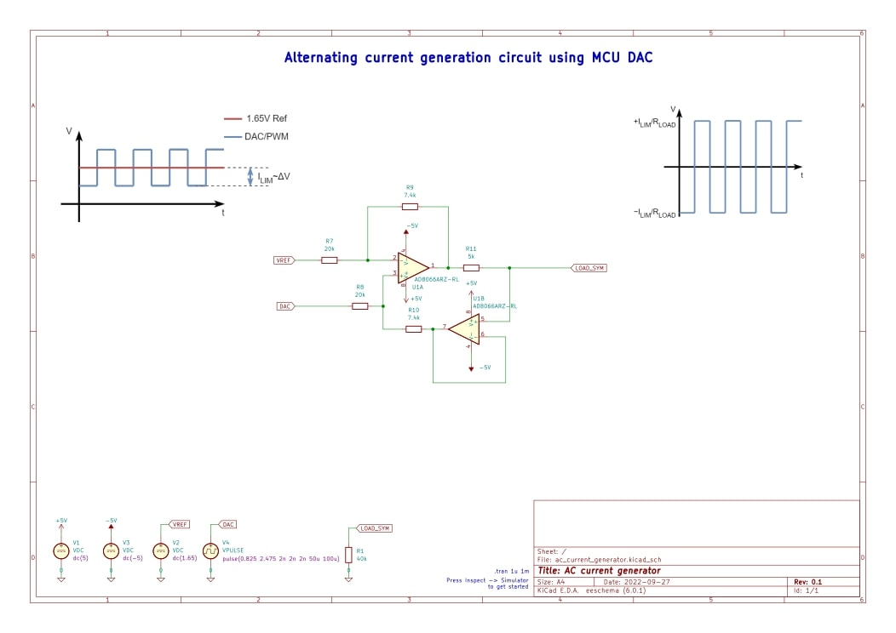

# ac_current_generator

## Video with the circuit description

https://youtu.be/Bf4n697qHjU

## Description
This particular circuit gives the MCU an abilty to generate AC current with required amplitude using only the DAC and 2 general purpose opamps.

## Usage
Insparation is that you can copy the repo and get a reusable circuit block. 

## Support
Please, contact me if you need any help  
Telegramm: https://t.me/Plinsboorg  
Email: dennis.yaskevich@proton.me  
I do commercial electronics design and consulting.  
I can also help you for free if you're doing an open hardware project. 

## Roadmap
I'll continue adding intresting analog circuits as separate repos

## Contributing
Please, submit your fixes if you see any mistakes or possible improvments.

## Authors and acknowledgment
This circuit is inspired by Flexi-TEER project
https://github.com/mdanderson03/Flexi-TEER

## License
[Attribution 4.0 International (CC BY 4.0)](https://creativecommons.org/licenses/by/4.0/)
